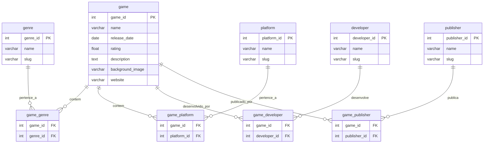

# Projeto de Banco de Dados - Importação de Jogos

## Integrantes do Grupo
- João Paulo Paggi Zuanon Dias - 22.222.058-4
- Thales Clemente Pasquotto - 22.222.033-7
- Gustavo Dias Vicentin - 22.123.061-8

## Descrição do Projeto

Este projeto tem como objetivo importar dados de jogos da API RAWG e armazenar as informações em um banco de dados PostgreSQL usando o Supabase como provedor de banco de dados.

## Modelo Entidade Relacionamento (MER)



## Modelo Relacional na 3FN (Normalização)

1. **Tabela `game`**:
   - Atributos: `game_id`, `name`, `release_date`, `rating`, `description`, `background_image`, `website`
   - Chave primária: `game_id`

2. **Tabela `genre`**:
   - Atributos: `genre_id`, `name`, `slug`
   - Chave primária: `genre_id`
   - Chave única: `slug`

3. **Tabela `game_genre`**:
   - Atributos: `game_id`, `genre_id`
   - Chave primária composta: `(game_id, genre_id)`
   - Chaves estrangeiras: `game_id` referenciando `game(game_id)`, `genre_id` referenciando `genre(genre_id)`

4. **Tabela `platform`**:
   - Atributos: `platform_id`, `name`, `slug`
   - Chave primária: `platform_id`
   - Chave única: `slug`

5. **Tabela `game_platform`**:
   - Atributos: `game_id`, `platform_id`
   - Chave primária composta: `(game_id, platform_id)`
   - Chaves estrangeiras: `game_id` referenciando `game(game_id)`, `platform_id` referenciando `platform(platform_id)`

6. **Tabela `developer`**:
   - Atributos: `developer_id`, `name`, `slug`
   - Chave primária: `developer_id`
   - Chave única: `slug`

7. **Tabela `game_developer`**:
   - Atributos: `game_id`, `developer_id`
   - Chave primária composta: `(game_id, developer_id)`
   - Chaves estrangeiras: `game_id` referenciando `game(game_id)`, `developer_id` referenciando `developer(developer_id)`

8. **Tabela `publisher`**:
   - Atributos: `publisher_id`, `name`, `slug`
   - Chave primária: `publisher_id`
   - Chave única: `slug`

9. **Tabela `game_publisher`**:
   - Atributos: `game_id`, `publisher_id`
   - Chave primária composta: `(game_id, publisher_id)`
   - Chaves estrangeiras: `game_id` referenciando `game(game_id)`, `publisher_id` referenciando `publisher(publisher_id)`

## Criação das Tabelas em SQL

```sql
-- Criação das tabelas principais
CREATE TABLE game (
    game_id SERIAL PRIMARY KEY,
    name VARCHAR(255) NOT NULL,
    release_date DATE,
    rating FLOAT,
    description TEXT,
    background_image VARCHAR(255),
    website VARCHAR(255)
);

CREATE TABLE genre (
    genre_id SERIAL PRIMARY KEY,
    name VARCHAR(100) NOT NULL,
    slug VARCHAR(100) NOT NULL UNIQUE
);

CREATE TABLE platform (
    platform_id SERIAL PRIMARY KEY,
    name VARCHAR(100) NOT NULL,
    slug VARCHAR(100) NOT NULL UNIQUE
);

CREATE TABLE developer (
    developer_id SERIAL PRIMARY KEY,
    name VARCHAR(100) NOT NULL,
    slug VARCHAR(100) NOT NULL UNIQUE
);

CREATE TABLE publisher (
    publisher_id SERIAL PRIMARY KEY,
    name VARCHAR(100) NOT NULL,
    slug VARCHAR(100) NOT NULL UNIQUE
);

-- Criação das tabelas de relacionamento
CREATE TABLE game_genre (
    game_id INTEGER REFERENCES game(game_id) ON DELETE CASCADE,
    genre_id INTEGER REFERENCES genre(genre_id) ON DELETE CASCADE,
    PRIMARY KEY (game_id, genre_id)
);

CREATE TABLE game_platform (
    game_id INTEGER REFERENCES game(game_id) ON DELETE CASCADE,
    platform_id INTEGER REFERENCES platform(platform_id) ON DELETE CASCADE,
    PRIMARY KEY (game_id, platform_id)
);

CREATE TABLE game_developer (
    game_id INTEGER REFERENCES game(game_id) ON DELETE CASCADE,
    developer_id INTEGER REFERENCES developer(developer_id) ON DELETE CASCADE,
    PRIMARY KEY (game_id, developer_id)
);

CREATE TABLE game_publisher (
    game_id INTEGER REFERENCES game(game_id) ON DELETE CASCADE,
    publisher_id INTEGER REFERENCES publisher(publisher_id) ON DELETE CASCADE,
    PRIMARY KEY (game_id, publisher_id)
);
```

## Explicação do Código

O código fornecido é uma aplicação Python que realiza um processo de ETL (Extract, Transform, Load) para importar dados de jogos da API RAWG e armazená-los em um banco de dados PostgreSQL usando o Supabase como provedor.

As principais etapas do código são:

1. Configuração das variáveis de ambiente necessárias (chave da API RAWG, URL e chave do Supabase).
2. Definição de funções para obter dados da API RAWG, inserir registros nas tabelas do banco de dados e realizar as associações entre as entidades.
3. A função `main()` é responsável por executar o processo de importação, que consiste em:
   - Obter a lista de jogos da API RAWG, paginando os resultados.
   - Para cada jogo, inserir o registro na tabela `game` e criar os relacionamentos nas tabelas de associação (`game_genre`, `game_platform`, `game_developer`, `game_publisher`).
   - Respeitar os limites de taxa da API RAWG, aguardando 1 segundo entre cada requisição.

## Queries SQL Interessantes

1. Listar todos os jogos ordenados por data de lançamento descendente:
```sql
SELECT * 
FROM game
ORDER BY release_date DESC;
```

2. Encontrar os 5 jogos com a melhor avaliação:
```sql
SELECT *
FROM game
ORDER BY rating DESC
LIMIT 5;
```

3. Listar todos os gêneros de jogos e a quantidade de jogos em cada gênero:
```sql
SELECT 
    g.name AS genre_name,
    COUNT(gg.game_id) AS game_count
FROM genre g
LEFT JOIN game_genre gg ON g.genre_id = gg.genre_id
GROUP BY g.name
ORDER BY game_count DESC;
```

4. Encontrar todos os jogos que foram desenvolvidos por determinada desenvolvedora (ex: "Rockstar Games"):
```sql
SELECT g.name, g.release_date, g.rating
FROM game g
JOIN game_developer gd ON g.game_id = gd.game_id
JOIN developer d ON gd.developer_id = d.developer_id
WHERE d.name = 'Rockstar Games'
```

5. Listar todas as plataformas com o número de jogos disponíveis para cada uma:
```sql
SELECT 
    p.name AS platform_name,
    COUNT(gp.game_id) AS game_count
FROM platform p
LEFT JOIN game_platform gp ON p.platform_id = gp.platform_id
GROUP BY p.name
ORDER BY game_count DESC;
```

6. Encontrar os jogos lançados entre duas datas específicas (ex: 01/01/2020 e 31/12/2021):
```sql
SELECT *
FROM game
WHERE release_date BETWEEN '2020-01-01' AND '2021-12-31'
ORDER BY release_date;
```

7. Listar os 3 jogos com a descrição mais longa:
```sql
SELECT name, LENGTH(description) AS description_length
FROM game
ORDER BY description_length DESC
LIMIT 3;
```

8. Encontrar todos os jogos que pertencem a um determinado gênero (ex: "Action"):
```sql
SELECT g.name, g.release_date, g.rating
FROM game g
JOIN game_genre gg ON g.game_id = gg.game_id
JOIN genre ge ON gg.genre_id = ge.genre_id
WHERE ge.name = 'Action'
```

9. Listar os jogos publicados por uma determinada editora (ex: "Electronic Arts"):
```sql
SELECT g.name, g.release_date, g.rating
FROM game g
JOIN game_publisher gp ON g.game_id = gp.game_id
JOIN publisher p ON gp.publisher_id = p.publisher_id
WHERE p.name = 'Electronic Arts'
```

10. Encontrar os jogos que foram desenvolvidos por mais de uma empresa:
```sql
SELECT g.name, g.release_date, g.rating
FROM game g
JOIN game_developer gd ON g.game_id = gd.game_id
GROUP BY g.game_id
HAVING COUNT(DISTINCT gd.developer_id) > 1
```
Certamente! Aqui estão os passos para executar o código em sua máquina:

## Pré-requisitos

1. Certifique-se de ter o Python 3.x instalado em seu sistema.
2. Instale as dependências necessárias executando o seguinte comando no terminal:

```
pip install -r requirements.txt
```

## Configuração

1. Crie um arquivo `.env` na raiz do projeto e adicione as seguintes variáveis de ambiente:

```
RAWG_API_KEY=sua_chave_da_api_rawg
SUPABASE_URL=sua_url_do_supabase
SUPABASE_KEY=sua_chave_do_supabase
```

Substitua `sua_chave_da_api_rawg`, `sua_url_do_supabase` e `sua_chave_do_supabase` pelos seus valores reais.

2. Certifique-se de ter um banco de dados PostgreSQL configurado e as tabelas criadas conforme o modelo relacional apresentado no README.md.
Caso não for utilizar o supabase, alterar a conexão com seu banco de acordo com o necessário.

## Executando o código

1. Abra um terminal na raiz do projeto.
2. Execute o script Python com o seguinte comando:

```
python app.py
```

O script irá executar o processo de ETL, coletando os dados da API RAWG e inserindo-os no banco de dados Supabase. Observe as mensagens no console para acompanhar o progresso.

